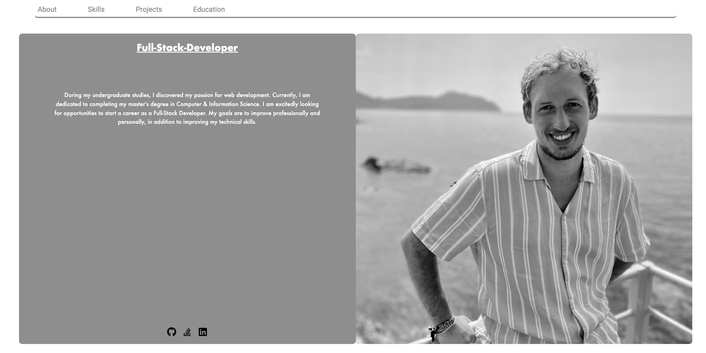
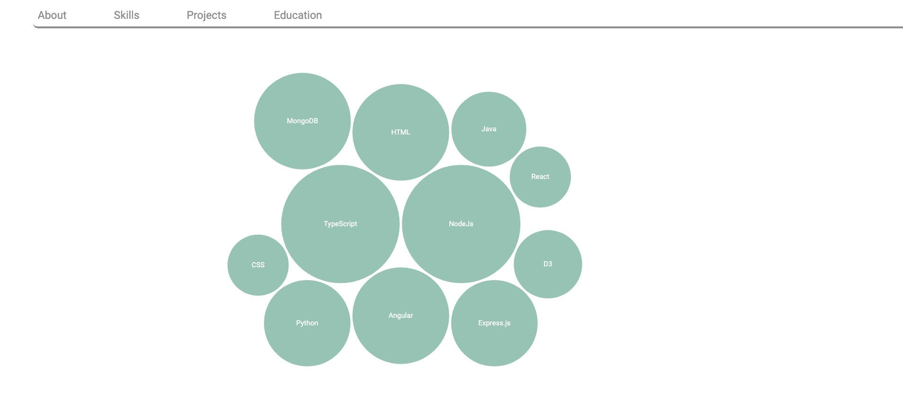
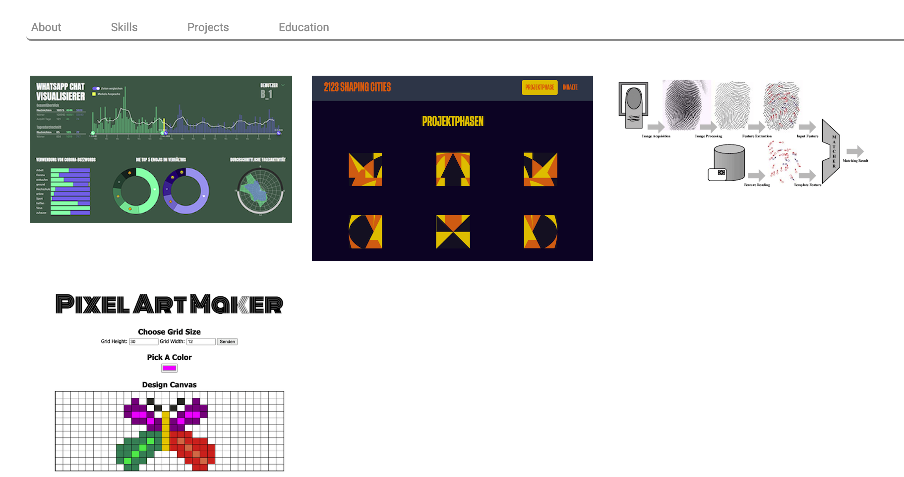
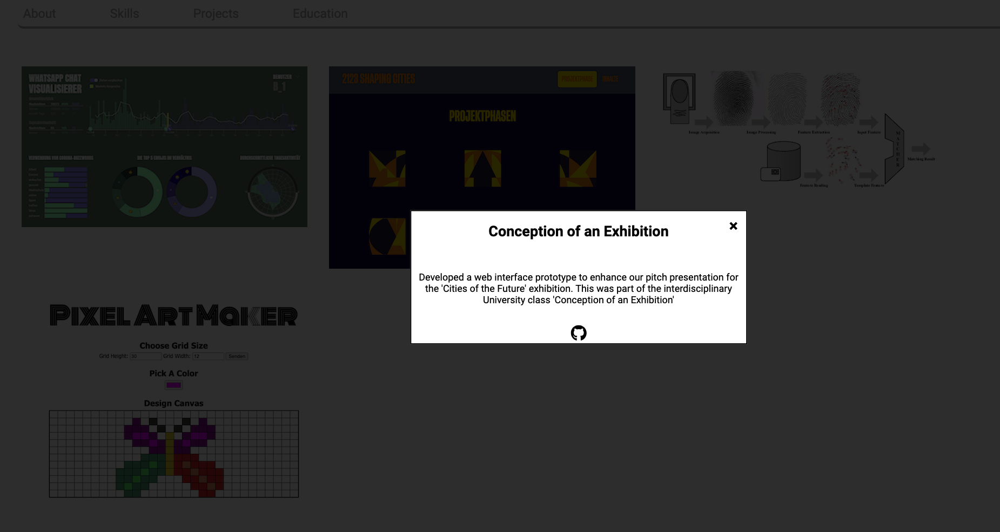

## Portfolio Website as Angular App for Hands on experience

### Finished so far the sections
- About
- Skils, but might implement alternative to the bubble chart
- And Projects (with Modals) as Gallery view.

### Look

